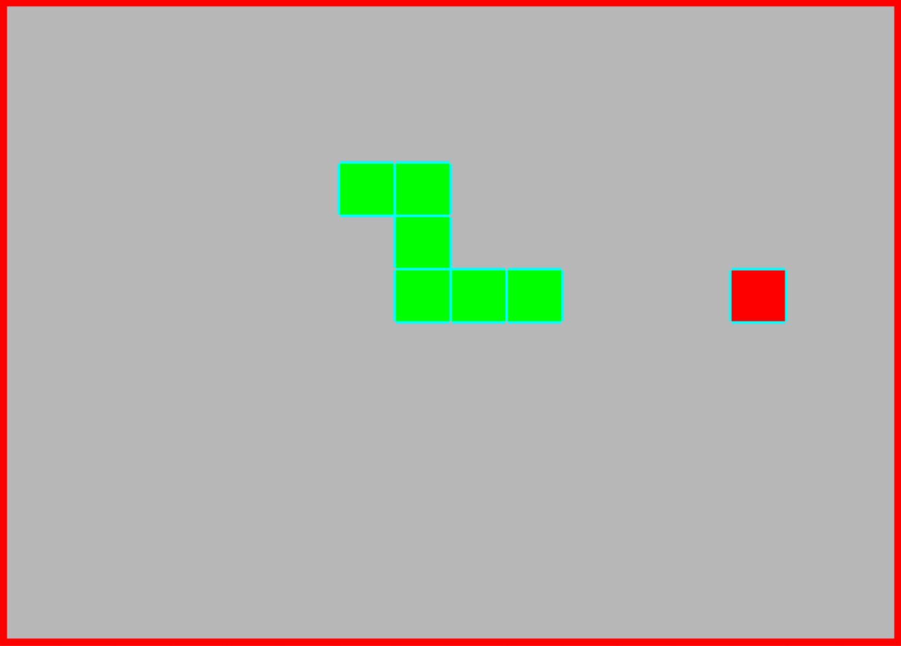

# RISC-V Assembly Snake Implementation

## 1. Intro:

This project is an implementation of the popular snake game in RISC-V, that runs on a custom processor in an FPGA board featuring interrputs, clock dividers, and a MMIO system for display outputs. The code for this project is modular and all within a single file for ease of generating a memory(.mem) file for programming. The program displays snake on a 160x120 VGA capable display. The game grid is 16x12

## 2. Structure:

The project consists of the following sections:

- data allocation
- main game loop
- movement
- collision check
- snake growth
- draw to VGA code
- clock divier
- reset on death
- generate apple coordinates
- pseudo random number generator
- Interrupt Service Routine for button presses

## 3. Register key:

| Registers | Use                                           |
| --------- | --------------------------------------------- |
| s0        | 160, the number of columns in the VGA display |
| s1        | 120, the number of rows in the VGA display    |
| s2        | VGA MMIO address (0x11000120)                 |
| s3        | VGA color MMIO address (0x11000140)           |
| s8        | Buttons MMIO address (0x11000060)             |
| s9        | Score, write out to 7-seg (0x11000040)        |
| s10       | tail position, before the move                |
| s11       | new snake head position, post move            |

## 4. Data allocation map:

Initialization data:

- Direction, 0x1 (0 for up, 1 for right, 2 for down, 3 for left)
- snake length, 0x3
- apple coordinates 0x0005000c (5 down, 12 right)
- pseudo random number generator table
- random number generator index
- snake blocks (position in y, x):
  .word 0x00050008 # Position (5, 8)
  .word 0x00050007 # Position (5, 7)
  .word 0x00050006 # Position (5, 6)

## 5. Installation and Usage:

Note: this was tested with a Basys-3 Artix-7 board from [Digilent](https://digilent.com/shop/basys-3-artix-7-fpga-trainer-board-recommended-for-introductory-users/)

1.  Install the RARS simulator from [GitHub](https://github.com/TheThirdOne/rars)(tested with v1.6).
2.  Open the snake.asm file in rars and compile it
3.  Generate a `otter_memory.mem` file in hexadecimal, and inclue BOTH data and text segments
4.  Install Xilinx Vivado
5.  Download the 32-bit RISV-V processor from [GitHub](https://github.com/Eclypsee/risc-v-processor)
6.  Replace the `Basys3_constraints.xdc` file and `OTTER_Wrapper_v1_02.sv` and `otter_memory.mem` with the ones here
7.  Setup the VGA display by installing the [VGA_driver](https://github.com/phummel/OTTER-Peripherals/blob/main/SystemVerilog/VGA%20160x120/vga_driver.sv), [VGA_ram](https://github.com/phummel/OTTER-Peripherals/blob/main/SystemVerilog/VGA%20160x120/ram30k_12.sv), [VGA_fb_driver](https://github.com/phummel/OTTER-Peripherals/blob/main/SystemVerilog/VGA%20160x120/vga_fb_driver.sv)
8.  Import System Verilog files in this repo as design sources, import the mem file as a design source, import the constraints as a constraints file
9.  Generate a bitstream and run on the Basys 3 board and have fun! Score is displayed via seven seg, and the buttons control the direction.
